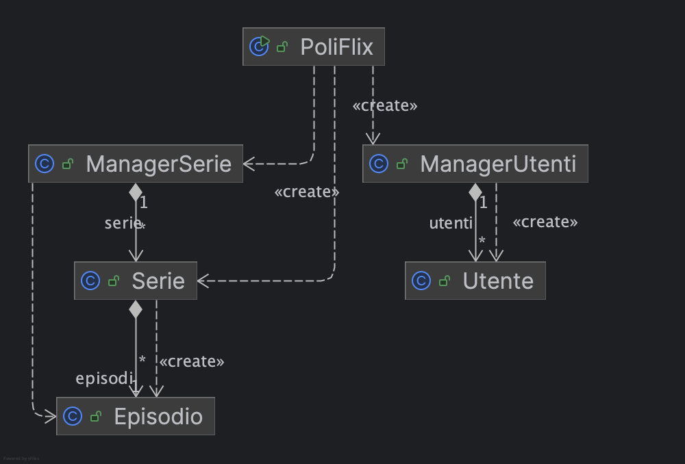
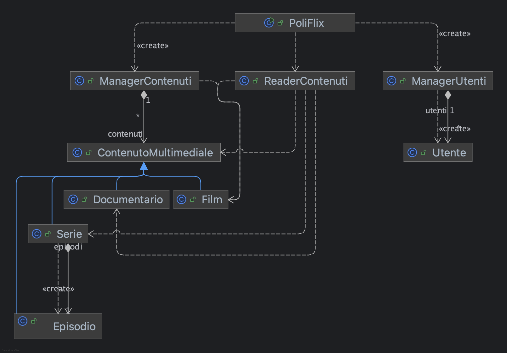
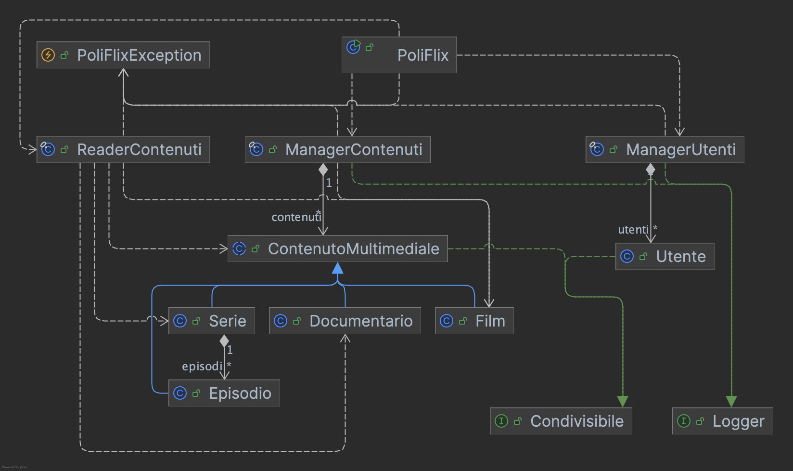
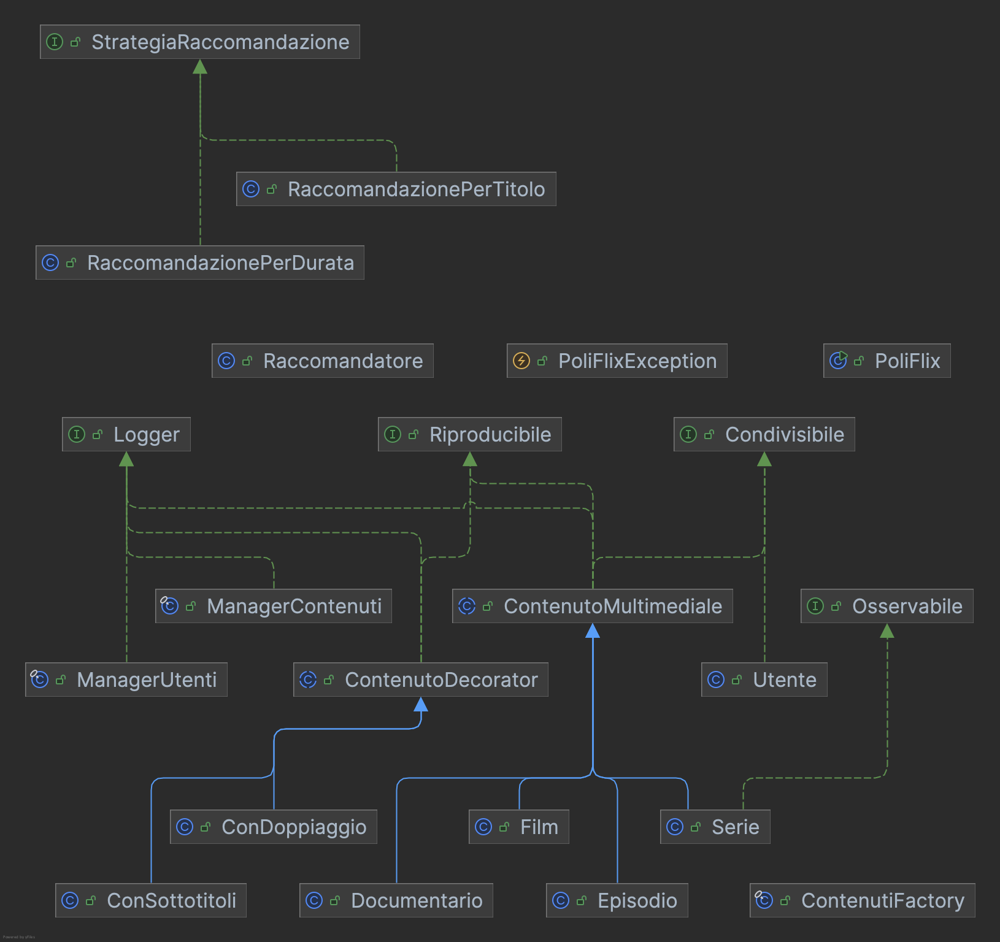
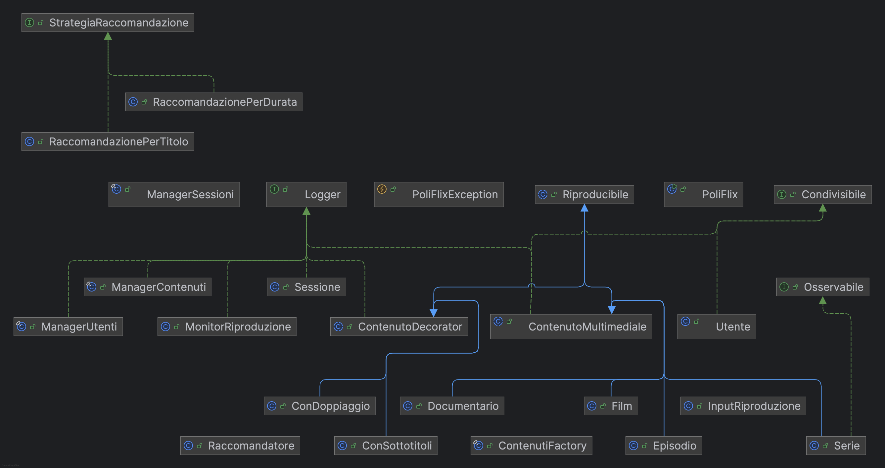
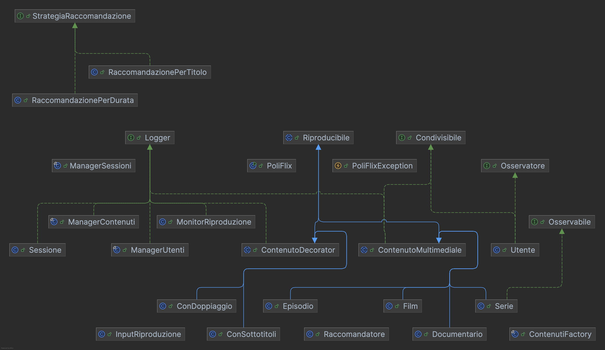

Questo repository raccoglie gli esempi mostrati a lezione. 
Di seguito, la descrizione, package per package, degli argomenti trattati:

<strong>1) Package: warm_up</strong>

- Obiettivo: ripassare le basi di Java e dell’I/O da console, strutture dati semplici e un primo mini‑esempio “PoliFlix”.
- File principali:
  - [warm_up.Step1](src/warm_up/Step1.java) 
    - Stampa su console
    - Tipi primitivi (int, double, boolean)
    - Stringhe e lettura input con Scanner
    - Ciclo while e condizione di uscita (comando "esci")
  - [warm_up.Step2](src/warm_up/Step2.java) 
    - Array e for “compatto” 
    - Liste 
  - [warm_up.Step3_PoliFlix](src/warm_up/Step3_PoliFlix.java) 
    - Mini applicazione testuale: registrazione e login utenti
    - Uso di liste parallele (username/password)
    - Menu a scelta con Scanner e gestione di uno “stato utente loggato”

<strong>2) Package: basi_oop</strong>

- Obiettivo: introdurre le basi della programmazione a oggetti (incapsulamento, oggetti e manager), lettura da file e una piccola app di esempio “PoliFlix”.

  2.1) Sottopacchetto: basi_oop.poliflix
  - File principali:
    - [basi_oop.poliflix.PoliFlix](src/basi_oop/poliflix/PoliFlix.java) (main)
      - Entry point dell’applicazione
      - Menu contestuale (non loggato/loggato)
      - Composizione con ManagerUtenti e ManagerSerie
    - [basi_oop.poliflix.serie.Utente](src/basi_oop/poliflix/utenti/Utente.java), [basi_oop.poliflix.serie.Serie](src/basi_oop/poliflix/serie/Serie.java), [basi_oop.poliflix.serie.Episodio](src/basi_oop/poliflix/serie/Episodio.java)  (modello dominio)
  - Cosa mostra:
      - Incapsulamento e oggetti di dominio (Utente, Serie, Episodio)
      - Manager e composizione (PoliFlix + ManagerUtenti, ManagerSerie)
      - Lettura e parsing da CSV (Serie.leggiSerieDaCsv su resources/series.csv)
  
  - Risorse d’esempio:
     - [resources/series.csv](resources/files/series.csv) (file CSV letto da Serie.leggiSerieDaCsv)

   2.2) Sottopacchetto: basi_oop.file
   - File principali:
     - [basi_oop.file.TestFile](src/basi_oop/file/TestFile.java) (main)
       - Scrittura su file con PrintWriter
       - Lettura con tre approcci: BufferedReader, Scanner, Files.readAllLines

  - Cosa mostra:
    - Incapsulamento e oggetti di dominio (Utente, Serie, Episodio)
    - Manager e composizione (PoliFlix + ManagerUtenti, ManagerSerie)
    - Lettura e parsing da CSV (Serie.leggiSerieDaCsv su resources/series.csv)
    - Menu testuale con stato utente (non loggato/loggato)
    - Collezioni e iterazione su elenchi di oggetti

<strong>3) Package: ereditarieta</strong>

- Obiettivo: introdurre ereditarietà e polimorfismo applicati a PoliFlix; mostrare override dei metodi, upcasting e gestione uniforme di tipi diversi tramite una superclasse comune.

  3.1) Sottopacchetto: ereditarieta.poliflix
  - File principali:
    - [new.poliflix.PoliFlix](src/oop_avanzato/poliflix/PoliFlix.java) (main)
      - Entry point: menù non loggato/loggato, integrazione con ManagerUtenti e ManagerContenuti
    - Contenuti (gerarchia):
      - [contenuti.new.poliflix.ContenutoMultimediale](src/oop_avanzato/poliflix/contenuti/ContenutoMultimediale.java) (superclasse)
      - [contenuti.new.poliflix.Film](src/oop_avanzato/poliflix/contenuti/Film.java), [contenuti.new.poliflix.Documentario](src/oop_avanzato/poliflix/contenuti/Documentario.java), [contenuti.new.poliflix.Serie](src/oop_avanzato/poliflix/contenuti/Serie.java), [contenuti.new.poliflix.Episodio](src/oop_avanzato/poliflix/contenuti/Episodio.java)
      - [contenuti.new.poliflix.ManagerContenuti](src/oop_avanzato/poliflix/contenuti/ManagerContenuti.java)
      - [contenuti.new.poliflix.ReaderContenuti](src/oop_avanzato/poliflix/contenuti/ReaderContenuti.java)
    - Utenti:
      - [utenti.new.poliflix.ManagerUtenti](src/oop_avanzato/poliflix/utenti/ManagerUtenti.java), [utenti.new.poliflix.Utente](src/oop_avanzato/poliflix/utenti/Utente.java)
  - Cosa mostra:
    - Una gerarchia di tipi con superclasse (ContenutoMultimediale) e sottoclassi (Film, Documentario, Serie, Episodio)
    - Polimorfismo su ContenutoMultimediale.riproduci() e override dove necessario
    - Lettura da CSV unica ([ReaderContenuti.leggiDaCsv](src/oop_avanzato/poliflix/contenuti/ReaderContenuti.java)) che istanzia il sottotipo in base alla prima colonna (Film/Documentario/Serie)
  - Risorse d’esempio:
    - [resources/contenuti.csv](resources/files/contenuti.csv)
    - Diagrammi: [resources/diagrams/PoliFlix_2.png](resources/diagrams/PoliFlix_2.png), [resources/diagrams/PoliFlix_3.png](resources/diagrams/PoliFlix_3.png)

<strong>4) Package: oop_avanzato</strong>

- Obiettivo: mostrare concetti OOP avanzati applicati a PoliFlix: classi astratte e metodi final, interfacce e metodi default, overloading/override, eccezioni custom, serializzazione e lettura da CSV con istanziazione del sottotipo.

  4.1) Sottopacchetto: oop_avanzato.poliflix
  - File principali:
    - [oop_avanzato.poliflix.PoliFlix](src/oop_avanzato/poliflix/PoliFlix.java) (main)
      - Entry point: menù non loggato/loggato, integrazione con ManagerUtenti e ManagerContenuti
    - Contenuti (gerarchia):
      - [oop_avanzato.poliflix.contenuti.ContenutoMultimediale](src/oop_avanzato/poliflix/contenuti/ContenutoMultimediale.java) (superclasse astratta)
      - [oop_avanzato.poliflix.contenuti.Film](src/oop_avanzato/poliflix/contenuti/Film.java), [oop_avanzato.poliflix.contenuti.Documentario](src/oop_avanzato/poliflix/contenuti/Documentario.java), [oop_avanzato.poliflix.contenuti.Serie](src/oop_avanzato/poliflix/contenuti/Serie.java), [oop_avanzato.poliflix.contenuti.Episodio](src/oop_avanzato/poliflix/contenuti/Episodio.java)
      - [oop_avanzato.poliflix.contenuti.ManagerContenuti](src/oop_avanzato/poliflix/contenuti/ManagerContenuti.java)
      - [oop_avanzato.poliflix.contenuti.ReaderContenuti](src/oop_avanzato/poliflix/contenuti/ReaderContenuti.java)
    - Utenti:
      - [oop_avanzato.poliflix.utenti.ManagerUtenti](src/oop_avanzato/poliflix/utenti/ManagerUtenti.java), [oop_avanzato.poliflix.utenti.Utente](src/oop_avanzato/poliflix/utenti/Utente.java)
    - Utils:
      - [oop_avanzato.poliflix.utils.Condivisibile](src/oop_avanzato/poliflix/utils/Condivisibile.java), [oop_avanzato.poliflix.utils.Logger](src/oop_avanzato/poliflix/utils/Logger.java), [oop_avanzato.poliflix.utils.PoliFlixException](src/oop_avanzato/poliflix/utils/PoliFlixException.java)

  - Cosa mostra:
    - Classe astratta (ContenutoMultimediale) con metodi final e override nelle sottoclassi (Film, Documentario, Serie, Episodio)
    - Interfacce (Condivisibile, Logger) e metodi default; implementazioni nei modelli di dominio
    - Serializzazione/Deserializzazione utenti su file ([resources/files/users.txt](resources/files/users.txt))
    - Gestione errori tramite eccezione custom ([PoliFlixException](src/oop_avanzato/poliflix/utils/PoliFlixException.java)) e try/catch nel main

  - Risorse d’esempio:
    - [resources/files/contenuti.csv](resources/files/contenuti.csv)
    - [resources/files/users.txt](resources/files/users.txt)
    - Diagrammi: [resources/diagrams/PoliFlix_4.png](resources/diagrams/PoliFlix_4.png)

<strong>5) Package: design_patterns</strong>

- Obiettivo: applicare i principali Design Pattern all’app PoliFlix (Singleton, Factory, Decorator, Observer, Strategy).

  5.1) Sottopacchetto: design_patterns.poliflix
- Contenuti e Pattern:
  - Singleton: [ManagerContenuti](src/design_patterns/poliflix/contenuti/ManagerContenuti.java), [ManagerUtenti](src/design_patterns/poliflix/utenti/ManagerUtenti.java)
  - Factory (creazione oggetti contenuto): [ContenutiFactory](src/design_patterns/poliflix/contenuti/factory/ContenutiFactory.java)
  - Decorator (funzionalità aggiuntive in riproduzione): [Riproducibile](src/design_patterns/poliflix/contenuti/decorator/Riproducibile.java), [ContenutoDecorator](src/design_patterns/poliflix/contenuti/decorator/ContenutoDecorator.java), [ConSottotitoli](src/design_patterns/poliflix/contenuti/decorator/ConSottotitoli.java), [ConDoppiaggio](src/design_patterns/poliflix/contenuti/decorator/ConDoppiaggio.java)
  - Observer (notifiche): [Osservabile](src/design_patterns/poliflix/contenuti/observer/Osservabile.java), [Osservatore](src/design_patterns/poliflix/utenti/observer/Osservatore.java)
  - Strategy (raccomandazioni): [StrategiaRaccomandazione](src/design_patterns/poliflix/contenuti/strategy/StrategiaRaccomandazione.java), [RaccomandazionePerTitolo](src/design_patterns/poliflix/contenuti/strategy/RaccomandazionePerTitolo.java), [RaccomandazionePerDurata](src/design_patterns/poliflix/contenuti/strategy/RaccomandazionePerDurata.java), [Raccomandatore](src/design_patterns/poliflix/contenuti/strategy/Raccomandatore.java)

- Cosa mostra:
  - Singleton per forzare l'esistenza di un'istanza unica per i due manager
  - Factory per centralizzare la creazione dei contenuti a partire da parametri o dati
  - Decorator per estendere il comportamento di riproduzione (es. sottotitoli, doppiaggio) senza modificare le classi esistenti
  - Observer per notificare gli utenti/observer su eventi (es. nuovi contenuti o stati di riproduzione)
  - Strategy per cambiare a runtime la logica di raccomandazione dei contenuti

- Risorse d’esempio:
  - [resources/files/contenuti.csv](resources/files/contenuti.csv)
  - Diagrammi: [resources/diagrams/PoliFlix_5.png](resources/diagrams/PoliFlix_5.png)

<strong>6) Package: concorrente</strong>

- Obiettivo: Introdurre nozioni relative alla programmazione concorrente, nello specifico creazione e gestione di thread e gestione thread-safe delle risorse condivise con esempi standalone e all'interno dell'app PoliFlix.

  6.1) Sottopacchetto: concorrente.esempio_base
  - File principali:
    - [concorrente.esempio_base.Main](src/concorrente/esempio_base/Main.java) (main)
    - [concorrente.esempio_base.EsempioThread](src/concorrente/esempio_base/EsempioThread.java)
    - [concorrente.esempio_base.EsempioRunnable](src/concorrente/esempio_base/EsempioRunnable.java)
    - [concorrente.esempio_base.EsempioMonitor](src/concorrente/esempio_base/EsempioMonitor.java)
    - [concorrente.esempio_base.EsempioScrittore](src/concorrente/esempio_base/EsempioScrittore.java)
    - [concorrente.esempio_base.EsempioLettore](src/concorrente/esempio_base/EsempioLettore.java)
  - Cosa mostra:
    - Differenze tra estendere Thread e implementare Runnable
    - Avvio e sincronizzazione: start(), join(), sleep()
    - Sincronizzazione con monitor: metodi synchronized, wait(), notifyAll()
    - Esempio produttore/consumatore con lettore/scrittore e coda singola
    - Gestione InterruptedException di base

  6.2) Sottopacchetto: concorrente.poliflix
- Obiettivo: introdurre la programmazione concorrente in PoliFlix

  - File principali:
    - Monitor riproduzione/input: [concorrente.poliflix.contenuti.monitor.MonitorRiproduzione](src/concorrente/poliflix/contenuti/monitor/MonitorRiproduzione.java), [concorrente.poliflix.contenuti.monitor.InputRiproduzione](src/concorrente/poliflix/contenuti/monitor/InputRiproduzione.java)

- Cosa mostra:
  - Creazione di thread per la riproduzione dei contenuti e thread separato per l’input utente (pausa/riprendi/uscita)
  - Sincronizzazione tramite monitor con metodi synchronized e wait/notifyAll per coordinare pausa/ripresa della riproduzione

- Risorse d’esempio:
  - Diagramma: [resources/diagrams/PoliFlix_6.png](resources/diagrams/PoliFlix_6.png)

<strong>7) Package: funzionale</strong>

- Obiettivo: introdurre i costrutti della programmazione funzionale (Stream/Collectors, Optional, method reference) con esempi standalone e l’app PoliFlix.

  7.1) Sottopacchetto: funzionale.esempio_base
  - File principali:
    - [funzionale.esempio_base.EsempiStream](src/funzionale/esempio_base/EsempiStream.java)
    - [funzionale.esempio_base.EsempiInterfacceFunzionali](src/funzionale/esempio_base/EsempiInterfacceFunzionali.java)
  - Cosa mostra:
    - Interfacce funzionali standard: `Predicate`, `Function`, `Supplier`, `Consumer` con lambda e method reference
    - `Runnable` e `Thread` con lambda (creazione e `join`)
    - `Comparator` con lambda su oggetti dominio (`Episodio`)
    - Method reference 
    - Interfaccia funzionale custom `@FunctionalInterface` [`OperazioneBinaria`](src/funzionale/esempio_base/OperazioneBinaria.java) e suo utilizzo con lambda
    - Pipeline Stream
    - Operazioni terminali
    - Confronto con approccio imperativo

  7.2) Sottopacchetto: funzionale.poliflix
  - 

  - Dove sono usate funzionalità della programmazione funzionale (solo punti rilevanti):
    - Ricerca e selezione contenuto in `ManagerContenuti.riproduci(String titolo)` ([file](src/funzionale/poliflix/contenuti/ManagerContenuti.java)):
      - `stream()` → `filter` → `map` → `findFirst()` per ottenere un `Optional<Riproducibile>`.
      - Uso di `Optional` per gestire l’assenza del contenuto senza `null` e rami annidati.
    - Raccomandazioni in [`RaccomandazionePerTitolo`](src/funzionale/poliflix/contenuti/strategy/RaccomandazionePerTitolo.java) e [`RaccomandazionePerDurata`](src/funzionale/poliflix/contenuti/strategy/RaccomandazionePerDurata.java):
      - Pipeline con `stream()` + `filter` + `limit` + `toList()` per produrre i suggerimenti.
    - Avvio riproduzione con method reference in `ManagerContenuti.riproduci(String titolo)` ([file](src/funzionale/poliflix/contenuti/ManagerContenuti.java)):
      - Creazione del `Runnable` via `contenutoDaRiprodurre::riproduci` (referenza a metodo) prima dell’avvio del thread.
    - Verifica utente esistente in `ManagerUtenti.utenteEsiste(Utente)` ([file](src/funzionale/poliflix/utenti/ManagerUtenti.java)):
      - `stream()` → `filter` → `findFirst()` → `isPresent()` per controllare le credenziali senza cicli e flag mutabili.

- Risorse d’esempio:
  - Diagrammi: [resources/diagrams/PoliFlix_7.png](resources/diagrams/PoliFlix_7.png)

